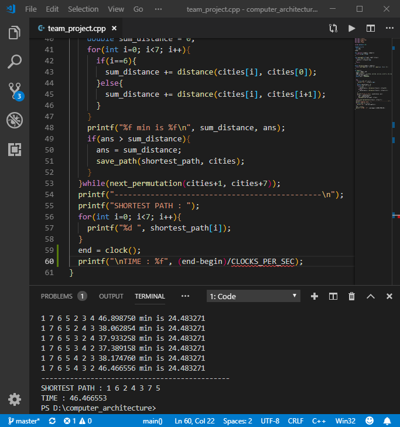
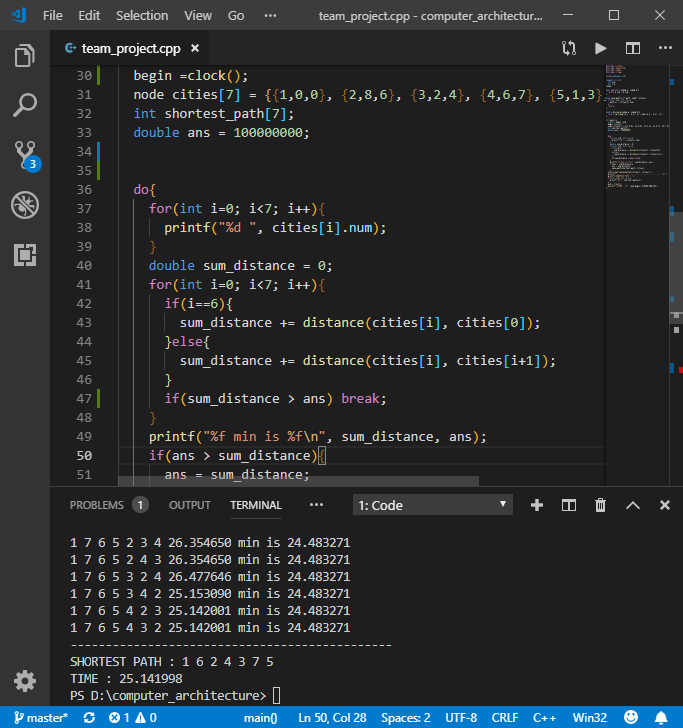

# Computer Architecture
## Team Project
- - -
>## ●Phase 1
>>### ●Algorithm Selection
>>>#####  ● We first chose brute-force search 
>>>
>>>##### Execution time in console : 46.47 ms 
>>#####  ● We add some codes and changed algorithm to backtracking 
>>>#####  ``` if(sum_distance > ans) break;``` 
>>>
>>> Execution time in console : 25.14 ms  
>>> We reduced time almost twice
