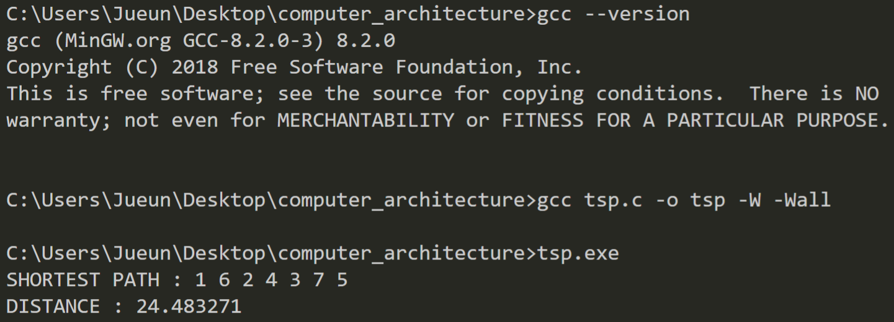

# TSP on MIPS
SWE3005 Computer Architectures 2019 Spring Course Project (Prof. Hee Yong Youn)

- - -
# Phase 1
High level language program

## Abstract
In this phase, we solve the TSP given in the assignment manual with the DFS algorithm. The algorithm uses the distance table reference and the problem branches pruning to reduce the search time. The proposed algorithm is implemented in C.

## Output

# Phase 2
(in progress)

# Phase 3
(in progress)
